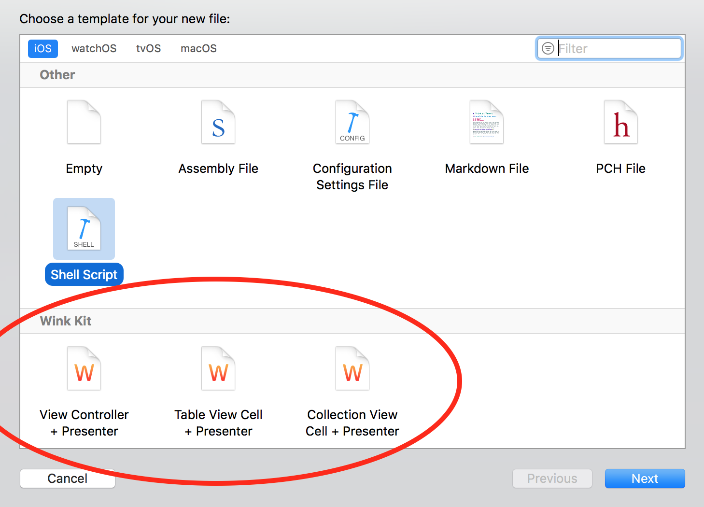
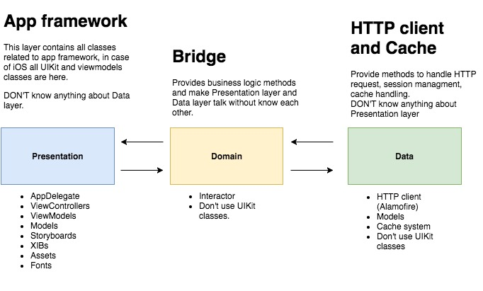
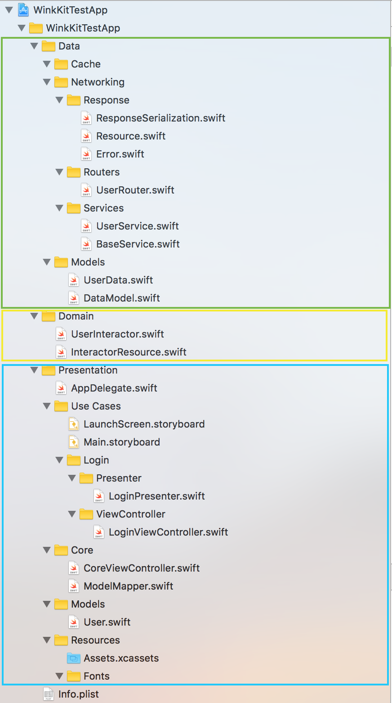
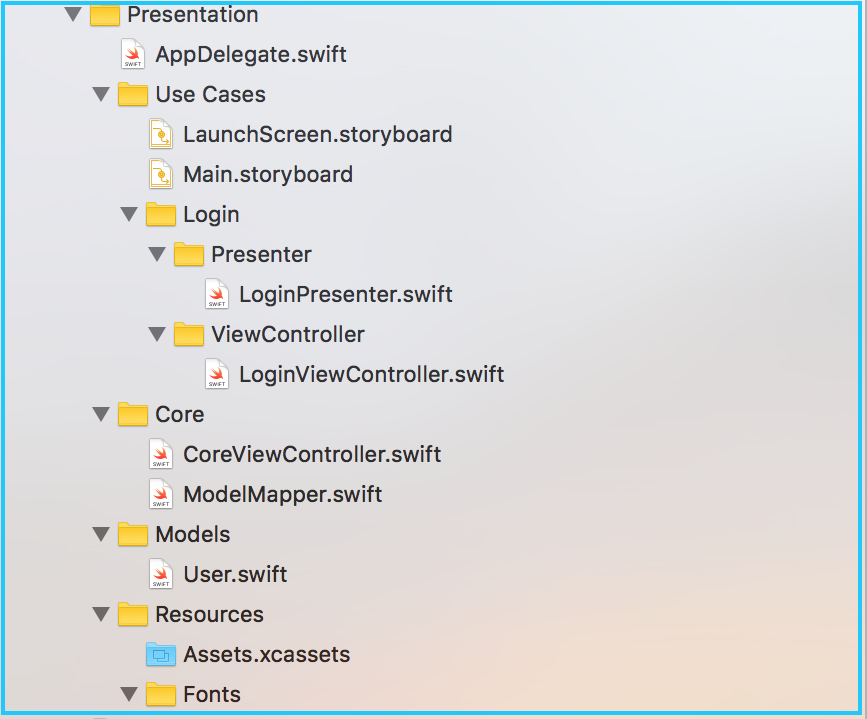
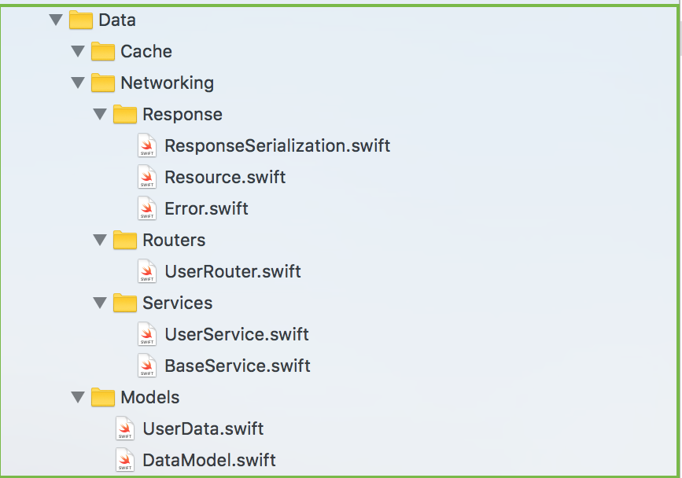
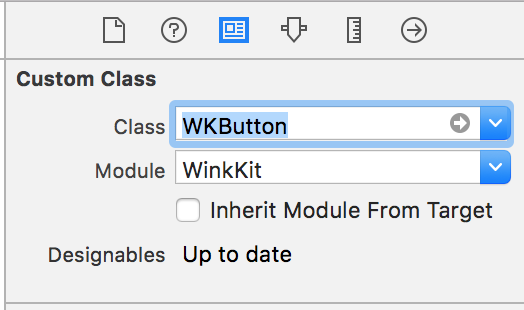
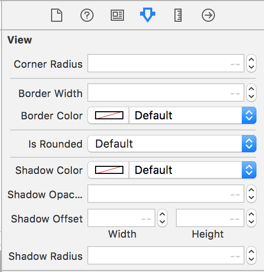

<p align="center">

</p>

WinkKit
========

[](http://cocoapods.org/pods/WinkKit)
[](http://cocoapods.org/pods/WinkKit)
[](http://cocoapods.org/pods/WinkKit)
[](https://developer.apple.com/swift)


An iOS framework that contains a set of classes that follow MVP pattern and solve some common problem written in Swift, used for Wink's application. Follow this guide to know how to structure a Wink iOS project.

## Table of Contents
1. [Getting Started](#Getting_Started)
2. [Understanding Structure](#Understanding_Structure)
3. [Using enhanced Views](#UI_Extension)
4. [Using ViewControllers and Presenters](#Using_ViewControllers)
5. [Using Table Views and Collection Views](#Using_TabColViews)
6. [Utils and more](#Utils_And_More)

## Getting Started <a name="Getting_Started"></a>

### Prerequisites

You need [Xcode 9](https://developer.apple.com/xcode/), Swift 4 and [CocoaPods](https://guides.cocoapods.org/using/getting-started.html) installed.

### Installing

Just paste the CocoaPods dependency in your  `podfile`. Due to a cocoapods bug, ensure to paste the **post_install** function too.

```ruby
# Podfile
use_frameworks!

target 'YOUR_TARGET_NAME' do

    # https://github.com/WINKgroup/WinkKit
    pod 'WinkKit'
    
end

# This post install is needed because of a Cocoapods bug; it is needed to render WinkKit properties in InterfaceBuilder correctly.
post_install do |installer|
    installer.pods_project.targets.each do |target|
        target.build_configurations.each do |config|
            config.build_settings['CONFIGURATION_BUILD_DIR'] = '$PODS_CONFIGURATION_BUILD_DIR'
        end
    end
end

```

**N.B.**: If you have compilation fails related to `AlamofireImage` target in generated Pod project, set Swift version to 3.2 for that target.

### Add project/file templates to Xcode (Optional but recommended)

WinkKit has been designed to help creating app with MVP pattern (you'll understand better later); to follow this pattern, it's needed to create for each view several files.
WinkKit contains a set of Xcode templates to make file creation faster; download <a href="./Xcode%20Templates/Template%20Files/Wink%20Kit.zip" download target="_blank" download>Template File</a>, extract and copy "Wink Kit" folder to 

	/Applications/Xcode.app/Contents/Developer/Library/Xcode/Templates/File Templates
	
Now in Xcode, under **File > New > File** (or CMD+N) you can create view controllers, table view cells and collection view cells that conform to MVP like following.

<p align="center">

</p>

## API Documentation

### Check the classes reference [here](./docs/index.html).

## Understanding Structure <a name="Understanding_Structure"></a>

Before talking about classes of framework we'll take a look on architecture structure. 

It is a MVP pattern; look at this [iOS Architectures overview](https://medium.com/ios-os-x-development/ios-architecture-patterns-ecba4c38de52) to understand differences between MVC, MVP, MVVM, VIPER.

A Wink iOS project **should** be structured in the following way, expecially if the project will grow a lot:




This kind of architecture is try to follow the **Responsability Distribution** concept: each layer exists without other ones and every component has different responsability; this improves the maintanance and the testability. The whole Xcode proj structure that maps this architecture is something like this:



<br>

### Presentation

It's the layer that contains all iOS Framework dedicated classes, like `UIKit` framework. We could say that this layer cannot exists without an iPhone/iPad because `UIKit` can run only there.



* **AppDelegate**: It's the well known AppDelegate class, nothing special;
* **Use Cases**: A group that contains all use cases. It's important to understand that a *Use Case* is what user do in one or more app screen, for example the Login.
	* **Login**: En example of a Use Case. It will contain all related ViewControllers, Presenter (if a use case contains more than one), DataSources etc.
		* **LoginPresenter**: A simple presenter; LoginPresenter keep the state of LoginViewController; a presenter is the class that contains logic, the ViewController does **not** contain logic. **Presenter doesn't contains UIKit classes!**, this is needed to keep presenters easy testable.
		* **LoginViewController**: In classic MVC pattern, (Massive View Controller in iOS world 😫) all logic was here, mixed with the view handling; in this framework a ViewController **owns** a presenter and delegates it for the logic. The view controller doesn't have a method `func performLogin(email: String, password: String)` for example; instead, the presenter does. The view controller will only receive user input and tell the presenter that something happened. The presenter will do work and tell the view controller that the view should change.
* **Core**: A group that contains base classes re-usable all around project. It's a good practice to define this classes to avoid code duplication that could increase the maintanance difficulty.\
* **Resources**: All resources go here, included .xcassets, custom fonts...

<br>

### Data
It's the layer that handles all data stuff, such as http calls, cache uploading/downloading to/from a backend. No `UIKit` classes in this layer!



* **Cache**: A group that contains classes like SessionManager and all other stuff that saves data locally.
* **Networking**: The group that contains the Http Client, which must be implemented with **Alamofire**. WinkKit provides [Alamofire](https://github.com/Alamofire/Alamofire) and [Alamofire Image](https://github.com/Alamofire/AlamofireImage) in the framework itself, so you don't need to add anything in the Podfile.
	* **ResponseSerialization**: Contains the `DataResponse` extension of Alamofire: it provides a common response for http calls that return an object instead of a json; json parsing is done in this extension (see source file for detail). Notice that this extension uses [Argo](https://github.com/thoughtbot/Argo) for json parsing. 
	* **Resource**: an enum that maps the response of https calls.
	* **Error**: the class/struct that maps http errors (both client and server) 
	* **Routers**: Routers are responsible to know api's endpoints and to create a `urlRequest` that are used by **Services** to perform http calls.
	* **Services**: Services perform http calls, using the request created by routers.

<br>

# Presentation

## Using enhanced Views <a name="UI_Extension"></a>

WinkKit provides common view classes that have more `@IBDesignable` in InterfaceBuilder.

- WKView
- WKImageView
- WKButton
- WKLabel
- WKTextView

Every class extends the `UIKit` one; for example `WKView` extends `UIView`. To use these classes in InterfaceBuilder, drag the object from the Object library and make it extends the desired WinkKit view.
For example to use a `WKButton`, drag a Button from Object library, then go to Identity Inspector and set the custom class:



**Make sure to leave WinkKit as module**

Then you can customize the button from Attributes inspector:



## Using ViewControllers and Presenters <a name="Using_ViewControllers"></a>

In a WinkKit app every view controller should extends the `WKViewController<P>` (or `WKTableViewController<P>` or `WKCollectionViewContrller<P>`, they have all same behaviours).

A `WKViewController` wants a subclass of `WKGenericViewControllerPresenter` (which is a protocol that extends the base presenter protocol `WKPresenter`) because the view controller life-cycle is bound to this kind of presenter. A typical implementation of home page is

```swift
// HomeViewController.swift

class HomeViewController: WKViewController<HomePresenter> {
	// do only UI stuff here
}

// Since the view controller is handled by HomePresenter, it must be conform to LoginView.
extension HomeViewController: LoginView {
	// implements all HomeView methods/properties
}


// HomePresenter.swift

// Define what the view can do
protocol LoginView: PresentableView {

}

class HomePresenter: WKGenericViewControllerPresenter {

    typealias View = LoginView // need to tell the protocol which is the view handled
    
    weak var view: LoginView? // keep view weak to avoid retain-cycle since view controller holds a reference to this presenter
    
    required init() {} // framework wants empty init
    
    // do all logic here, such as use a Service to fetch data and tell the view to update
}

```
**Notice that you don't need to call any method to bind the view controller and the presenter, everything is automatically done by the framework!** 🎉🎉🎉

HomePresenter and HomeViewController are two different files. You can use the file template to create quickly this structure 😉.


## Using Table Views and Collection Views <a name="Using_TabColViews"></a>

WinkKit provides both `WKTableView`, `WKCollectionView` and `WKTableViewCell`, `WKCollectionViewCell`.
Let's talk about `WKTableView` and `WKTableViewCell` (collection view has same logic).

**N.B.**: To have a better structure, all cell must have a xib: do **not** create cell in the storyboard directly.

The `WKTableView` provides two methods to register and dequeue a `WKTableViewCell` quickly by doing:

```swift
tableView.register(cell: ItemTableViewCell.self) // register the cell with a xib that has same name of the class

tableView.dequeueReusableCell(ofType: ItemTableViewCell.self, for: indexPath) // dequeue a cell, already casted

```

Cell acts like view controller: they have a presenter (in this case the plain `WKPresenter`) and they must conform to the view that the presenter handles. For this reason creating a cell is like creating a view controller:

```swift
// ItemTableViewCell.swift

class ItemTableViewCell: WKTableViewCell<ItemPresenter> {
	// do only UI stuff here
}

extension ItemTableViewCell: ItemView {
  	// implements all ItemView methods/properties  
}

// ItemPresenter.swift

/// The protocol that the cell handled by presenter must conforms to.
protocol ItemView: PresentableView {
    
}

/// The presenter that will handle all logic of the view.
class ItemPresenter: WKPresenter {
    
    typealias View = ItemView
    
    // The view associated to this presenter. Keep weak to avoid retain-cycle
    weak var view: ItemView?
	
	// the item that will be showed in this cell
	private var item: Item!
	 
    init(with item: Item) {
    	self.item = item
    }
    
    // do all logic here
}

```
You can use template to quickly create all of those class/protocols 😁.

Unlike view controllers, a cell must be configured after dequeued in the data source by doing something like:

```swift
func tableView(_ tableView: UITableView, cellForRowAt indexPath: IndexPath) -> UITableViewCell {
	let cell = tableView.dequeueReusableCell(ofType: ItemTableViewCell.self, for: indexPath)
  	let presenter = ItemPresenter() // create a presenter
  	cell.configure(with: presenter) // configure the cell with the presenter
  	return cell
}

```

### Collection View and Table View data source

As a best practice, it's better to decouple data sources from view controller. Avoid making a view controller as a data source to have all stuff better separated and re-usable. To communicate from data source to view controller, is it possible to use closures or delegation pattern. A typical implementation of a simple table view data source could be like:

```swift
class ItemDataSource: NSObject, UITableViewDataSource {
    
    private var items = [Any]()
    
    init(tableView: WKTableView) {
    	// register cell here so when you need this data source you don't have to repeat this line of code
    	tableView.register(cell: ItemTableViewCell.self)
    }
    
    func tableView(_ tableView: UITableView, numberOfRowsInSection section: Int) -> Int {
        return items.count
    }
    
    func tableView(_ tableView: UITableView, cellForRowAt indexPath: IndexPath) -> UITableViewCell {
        let cell = tableView.dequeueReusableCell(ofType: ItemTableViewCell.self, for: indexPath)
        let presenter = ItemPresenter(with: items[indexPath.row])
        cell.configure(with: presenter)
        
        return cell
    }
    
}

```

Then in your view controller use the data source as instance variable.

**Tips**: `WinkKit` provides few ready data source classes that have common methods, like inserting/deleting/reloading items or handle infinite scroll. Check `WKTableViewDataSource`, `WKCollectionViewDataSource` and `WKTableViewInfiniteDataSourceDelegate`. 

## Utils and more <a name="Utils_And_More"></a>

There are other classes and extensions that can be used to achieve some behaviour:

- Classes:
	- `Logger`: contains methods to log info and to avoid print debug info in release mode;
	- `OrderedSet`: it's like a `Set` but elements are ordered;
	- `Queue`: a simple queue class
- Extensions:
	- `UIAlertController`: contains method to show quickly an alert
	- `Date`: contains an `init` to create a date from a string and a format and some methods to get day, hour of month
	- `Collection`: constains a subscript to access values even if the index is wrong (it returns an optional)
	- `CALayer`: contains method to add border to a layer
	- `UIColor`: allow color creation with a hex string
	- `UIWindow`: contains method to get the current top most view controller.

## Authors

**Rico Crescenzio** - [Linkedin](https://www.linkedin.com/in/quirico-crescenzio-810263b9/)

## License

This project is licensed under the MIT License - see the [LICENSE.md](LICENSE.md) file for details
